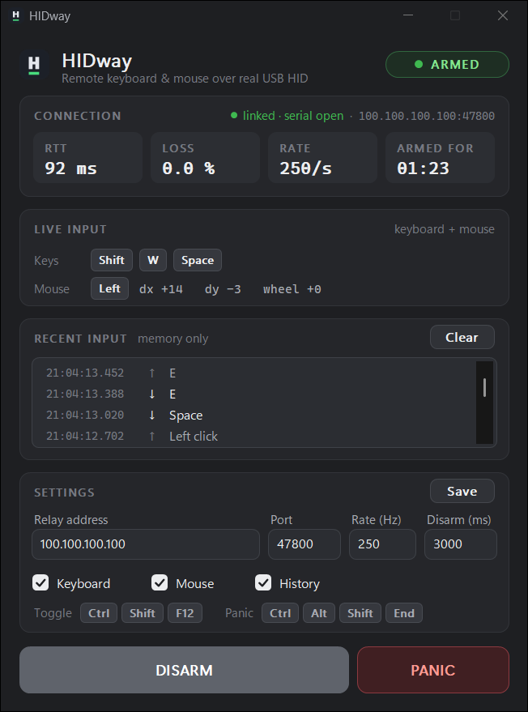

# HIDway

**Remote physical keyboard & mouse over a real USB HID interface.**

HIDway lets you control a computer from another PC across the network, where
the target machine sees nothing but an ordinary USB keyboard and mouse. A
Raspberry Pi Pico acts as a genuine USB HID device; a small relay on a
Raspberry Pi forwards input to it over an encrypted link. It is, in effect, a
build‑it‑yourself networked KVM for keyboard and mouse.

```
┌──────────────────────┐     UDP over          ┌───────────────────────┐
│  Remote PC           │     Tailscale          │  Raspberry Pi (relay)  │
│  hidway-client  ─────┼───────────────────────▶│  hidwayd               │
│  (reads your input)  │     (WireGuard)         │  (latest-state only)   │
└──────────────────────┘                         └──────────┬────────────┘
                                                            │ USB serial
                                                 ┌──────────▼────────────┐
                                                 │  Raspberry Pi Pico      │
                                                 │  TinyUSB HID kbd+mouse  │
                                                 └──────────┬──────────────┘
                                                            │ USB
                                                 ┌──────────▼────────────┐
                                                 │  Target PC              │
                                                 │  no driver, no software │
                                                 └─────────────────────────┘
```

<p align="center">
  
</p>

## Why

Some applications and games only accept input that arrives through a real
hardware device, and ignore input injected by software (remote‑desktop tools,
`SendInput`, virtual HID drivers). HIDway bridges that gap honestly: the input
you make on the remote PC is reproduced by a physical USB HID device on the
target, exactly as if a keyboard and mouse were plugged in locally.

## Design principles

- **Pure 1:1 relay of human input.** No macros, no automation, no scripted or
  assisted input of any kind.
- **Honest device identity.** The Pico enumerates as a plain HID keyboard and
  mouse under its own name. It never imitates another vendor and contains no
  detection‑evasion or hiding mechanism.
- **Fail‑safe everywhere.** Any lost link, timeout or crash ends in *all keys
  and buttons released*. A key can never stick.
- **No queues.** Every hop keeps only the latest complete state, so a lost or
  reordered packet is corrected by the next one instead of piling up lag.

## Responsible use

HIDway is a general‑purpose remote‑input device. You are responsible for
complying with the terms of service and rules of any software, game or service
you use it with. Some online games prohibit input from devices they consider
non‑standard, regardless of intent; HIDway does not and will not attempt to
hide what it is. Use it where you are permitted to.

## Components

| Part | Runs on | Purpose |
|------|---------|---------|
| `client/`   | Remote PC (Windows) | Reads your keyboard/mouse (Raw Input), shows an arm/disarm UI, relays the state over UDP. |
| `relay/`    | Raspberry Pi (Linux) | `hidwayd`: receives state, keeps the latest, forwards to the Pico, releases everything on link loss. |
| `firmware/` | Raspberry Pi Pico / Pico W | Enumerates as a USB HID keyboard + mouse (TinyUSB). |
| `common/`   | shared | Protocol, keyboard/mouse state logic, scan‑code→HID map. Pure C11, unit‑tested on the host. |
| `tests/`    | host | Unit tests for `common/` (ctest). |

The transport uses [Tailscale](https://tailscale.com/) (WireGuard) so the HID
endpoint is never exposed to the public internet and traffic is authenticated
and encrypted end to end.

## Build

### Host unit tests (any platform with a C compiler + CMake)

```bash
cmake -S . -B build -G Ninja
cmake --build build
ctest --test-dir build --output-on-failure
```

### Windows client

Built as part of the host build above (requires the MSVC toolchain). Output:
`build/client/hidway-client.exe`. Copy `client/hidway.ini.example` to
`hidway.ini` next to the executable and set your relay address.

The client lives in the system tray while you play: grey = disarmed, green =
armed and linked, red = link lost. Minimising sends it to the tray.

`hidway-client.exe --preview` / `--preview-armed` render the UI with sample
data and no network or input capture; add `--shot=out.bmp` to save a
screenshot (used for the image above).

### Pico firmware

Requires the [Pico SDK](https://github.com/raspberrypi/pico-sdk) and the Arm
GNU toolchain.

```bash
cmake -S firmware -B build/firmware -G Ninja -DCMAKE_BUILD_TYPE=Release
cmake --build build/firmware
# flash build/firmware/hidway_fw.uf2 via BOOTSEL
```

On Windows, `tools/build.ps1` builds both the firmware and the host tests.

### Relay (`hidwayd`) on the Raspberry Pi

As a sandboxed systemd service, deployed by release tags (daily check, never
restarted during a session, automatic rollback) with a status command:

```bash
sudo relay/deploy/install.sh
hidway-status
```

See [docs/RELAY.md](docs/RELAY.md). To build and run it by hand instead:

```bash
cd relay
make && make check
./hidwayd --bind <pi-tailscale-ip> --allow <client-tailscale-ip> --port 47800 \
          --serial /dev/hidway-serial
```

## Status

Early development. See [docs/ROADMAP.md](docs/ROADMAP.md) for the plan and
[docs/CHECKLIST.md](docs/CHECKLIST.md) for progress. The full design, trade‑offs
and what is proven vs. unverified is in
[docs/ARCHITECTURE.md](docs/ARCHITECTURE.md).

## Security

See [SECURITY.md](SECURITY.md) for the threat model and how to report issues.

## License

[MIT](LICENSE).
